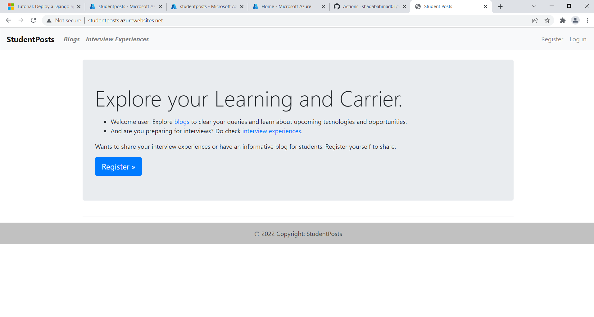
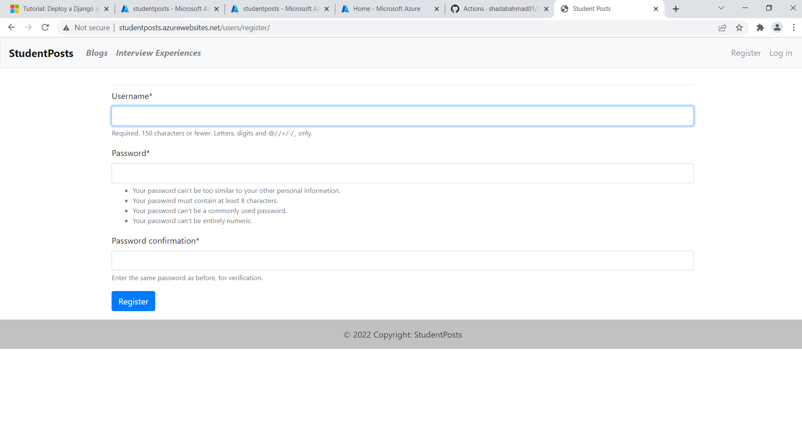
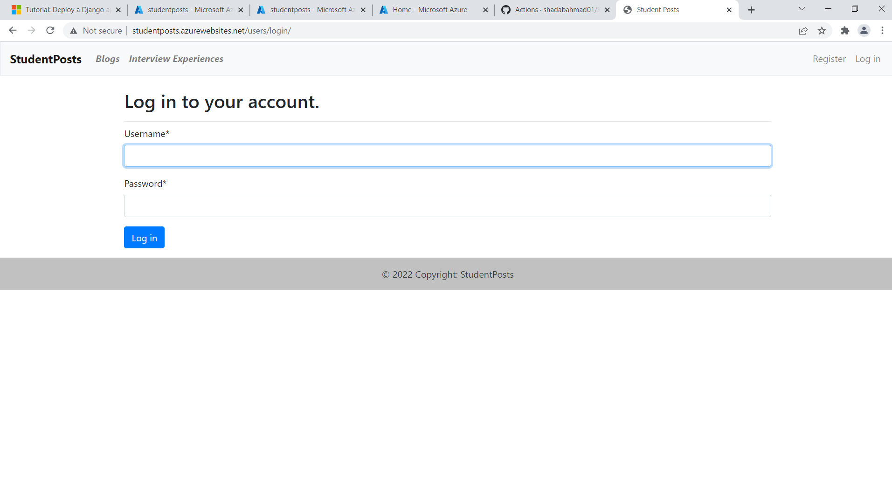
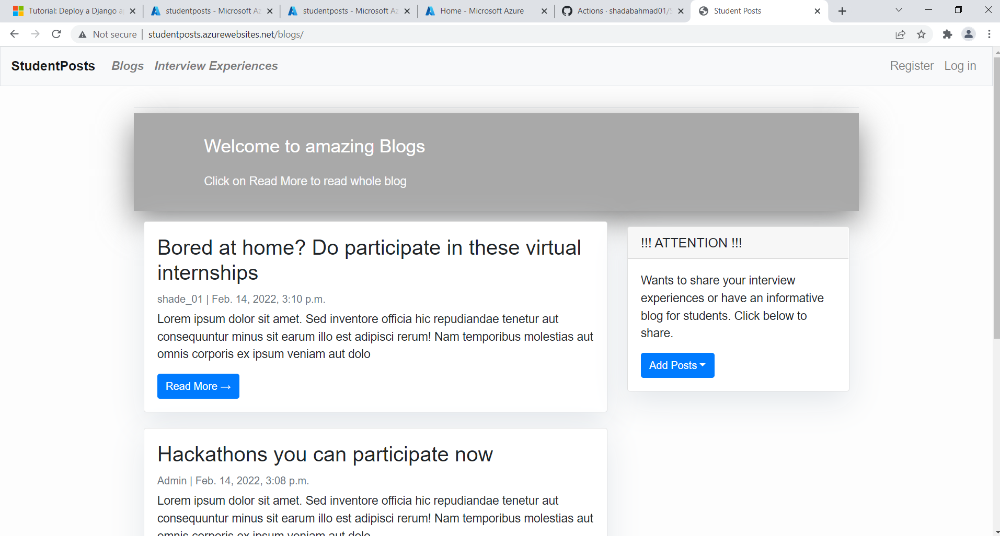
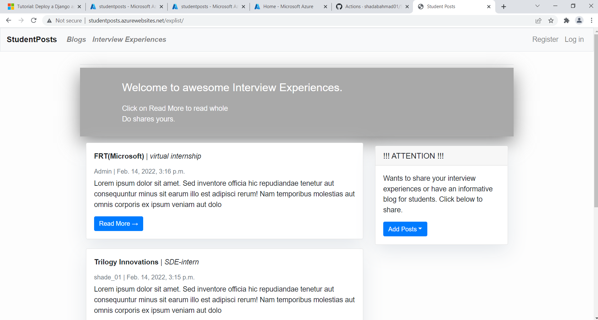
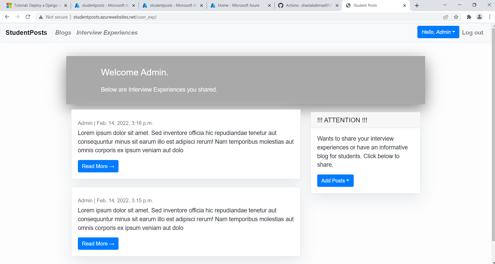
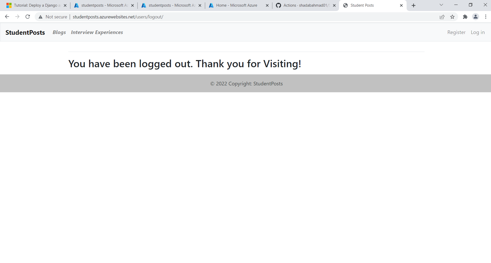

# Student_Posts
## About Website
My project aims to provide a platform where new sophomore can have complete guide of college . Website have a blogs and InterviewExperience sections. The interview experience section is particularly to help sophomores about palcement. In blogs section one can share posts about new technologies, projects, college events, etc. So seniors don't have to answer sophomore questions one by one, and new sophomores can get their most queries at one place. To read blogs and interview experiences all we need to visit the website but to post any blog or interview experience a user has to first register himself.
## Technologies Used
 - <b>Front-end</b> - HTML, CSS and Bootstrap
 - <b>Back-end</b> - Python Django Framework
 - <b>Database and Deployment</b> -  Azure Database for PostgreSQL, Azure App Service 
## Recources Used
 - FRT Self Learning
 - Microsoft Azure Documentation
 - Django Documentation
## Screenshots
 
 
 
 
 
 
 
 
